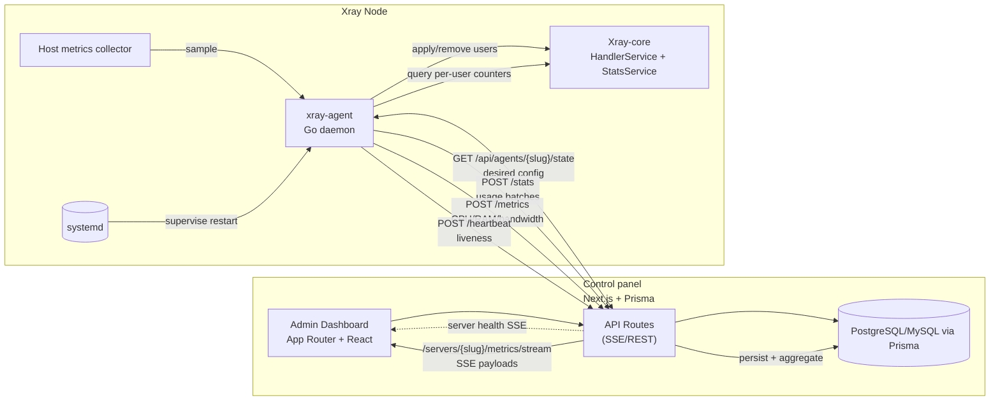

# xray-agent

Provisioning/telemetry side for Xray nodes. The agent stays on the same host as Xray, pulls desired state from a control-panel, reconciles users through Xray’s HandlerService gRPC API, manages routing rules via RoutingService, streams usage via StatsService, and periodically reports stats + heartbeats upstream.

## Highlights

- **Single source of truth** – Control-panel drives `state` JSON; the agent diffs and applies only the deltas.
- **HandlerService apply** – Users are added/removed live via gRPC; no config.json juggling or daemon reloads.
- **RoutingService apply** – Routing rules (field rules) are pushed live via gRPC using outbound tags you define (`direct`, `blocked`, or balancers).
- **Stats over gRPC** – User uplink/downlink counters come from the native StatsService (fast + no subprocesses).
- **Protocol aware** – VLESS / VMess / Trojan clients mapped to dedicated inbound tags for per-protocol isolation.
- **Lightweight** – Pure Go binary; depends only on Xray’s gRPC endpoints exposed on `localhost`.

## Architecture



### Component responsibilities

- **Control panel (web/)** – Next.js App Router handles both dashboard views and authenticated API endpoints. Prisma persists servers, clients, stats, metrics, and heartbeat tables, while SSE endpoints (e.g., `/servers/{slug}/metrics/stream`) push refreshed health cards to admins.
- **xray-agent (internal/agent/agent.go)** – Lightweight Go service started by systemd on each node. It keeps an in-memory client cache and runs four goroutines:
  1. `state_loop`: poll `/state`, diff vs. cached `config_version`, then call HandlerService to add/remove runtime users.
  2. `stats_loop`: fetch per-email counters via Xray StatsService and POST batches to `/stats`.
  3. `metrics_loop`: pull CPU, memory, and bandwidth samples from `internal/metrics` and POST to `/metrics` (Next.js aggregates rows into hourly/daily buckets for charts).
  4. `heartbeat_loop`: POST `/heartbeat` so the control panel can mark nodes offline when beats stop.
- **Xray-core integration** – Agent communicates with HandlerService/StatsService/RoutingService over gRPC (`127.0.0.1:10085` by default). HandlerService mutates in-memory users without touching config files, RoutingService applies runtime rules, and StatsService reports ever-increasing counters (optionally reset after each push).
- **Dashboard experience** – Admin UI hydrates server cards with `loadServerHealthEntry`, combining the latest heartbeat, server metrics, aggregates, and client listings. SSE events stream updates every ~10 seconds to keep charts and status badges current.

All gRPC traffic is expected to stay on localhost; expose Xray’s API listener only to the agent. The control panel never reaches into Xray directly—it only talks to the agent via HTTPS.

## Configuration

See `internal/agentsetup/assets/config.yaml` for the full schema. High-level knobs:

```yaml
control:
  base_url: https://panel.example.com
  token: AGENT_TOKEN
  server_slug: sg-1
  tls_insecure: false

xray:
  binary: /usr/local/bin/xray # still used for stats reset checks if needed
  api_server: 127.0.0.1:10085 # HandlerService + StatsService + RoutingService listener
  api_timeout_sec: 5
  stats_reset_each_push: true # tell StatsService to reset counters after read
  inbound_tags:
    vless: vless-ws
    vmess: vmess-ws
    trojan: trojan-ws

intervals:
  state_sec: 15
  stats_sec: 60
  heartbeat_sec: 30
  metrics_sec: 30

logging:
  level: info
```

### Client reconciliation

HandlerService must be enabled in your Xray config:

```json
{
  "api": {
    "tag": "xray-api",
    "services": ["HandlerService", "LoggerService", "StatsService"]
  },
  "stats": {}
}
```

The agent needs HandlerService for add/remove, StatsService for counters, and RoutingService for runtime rules. Keep the listener on `127.0.0.1` (or a UNIX socket) because the agent currently dials with plaintext credentials.

Base outbounds (sample config) include:

```json
{ "protocol": "freedom", "tag": "direct" },
{ "protocol": "blackhole", "tag": "blocked" }
```

If you add new outbounds/balancers, declare them statically in config; the agent only pushes rules that reference existing outbound/balancer tags.

## CLI / Install

The agent binary exposes subcommands (default path `/etc/xray-agent/config.yaml`):

- `run` — start the agent; auto-installs Xray-core if missing. Flags: `--config`, `--core-version`, `--github-token`.
- `setup` — install config (from embedded sample), binary to `/usr/local/bin/xray-agent`, and systemd unit to `/usr/lib/systemd/system/xray-agent.service`. Flags: `--config`, `--service`, `--bin`, `--control-base-url`, `--control-token`, `--control-server-slug`, `--control-tls-insecure`, `--github-token`.
- `update-config` — update control/github fields and restart agent. Flags: `--config`, `--control-base-url`, `--control-token`, `--control-server-slug`, `--control-tls-insecure`, `--github-token`, `--restart`.
- `core` — manage Xray-core install. Flags: `--action check|install`, `--version`, `--github-token`, `--config` (to read defaults).
- `version` — show agent version (from embedded `version` file) and commit (from build info).

### Quick install

```bash
go build -o xray-agent ./
sudo ./xray-agent setup \
  --control-base-url https://panel.example.com \
  --control-token AGENT_TOKEN \
  --control-server-slug sg-1 \
  --github-token GITHUB_PAT
```

Then start normally:

```bash
sudo ./xray-agent run --config /etc/xray-agent/config.yaml
```

Systemd unit (installed by setup subcommand): `/usr/lib/systemd/system/xray-agent.service` with `ExecStart=/usr/local/bin/xray-agent run --config /etc/xray-agent/config.yaml`.

## Control-panel contract

### `GET /api/agents/{server_slug}/state`

```json
{
  "config_version": 12,
  "clients": [
    { "proto": "vless", "id": "UUID", "email": "user_1@planA" },
    { "proto": "vmess", "id": "UUID", "email": "user_2@planB" },
    { "proto": "trojan", "password": "pass123", "email": "user_3@planC" }
  ],
  "routes": [
    {
      "tag": "ads-block",
      "outbound_tag": "blocked",
      "domain": ["geosite:category-ads"]
    },
    { "tag": "direct-local", "outbound_tag": "direct", "ip": ["geoip:private"] }
  ],
  "meta": { "ws_path": "/ws" }
}
```

Notes:

- `routes` are applied via RoutingService and live only in memory; ensure control/state endpoint re-sends them after an Xray restart.

### `POST /api/agents/{server_slug}/stats`

```json
{
  "server_time": "2025-11-07T15:01:00Z",
  "users": [{ "email": "user_1@planA", "uplink": 123, "downlink": 456 }]
}
```

### `POST /api/agents/{server_slug}/heartbeat`

```json
{ "ok": true }
```

### `POST /api/agents/{server_slug}/metrics`

```json
{
  "server_time": "2025-11-07T15:01:00Z",
  "cpu_percent": 42.5,
  "memory_percent": 71.2,
  "bandwidth_up_mbps": 85.1,
  "bandwidth_down_mbps": 233.7
}
```

Fields are optional; send whatever the agent could sample for that interval.

## Development

- Go ≥ 1.25.3 (module declares 1.25.3; see `go.mod`).
- Run `go test ./...` before submitting changes.
- Formatter: `gofmt` (already wired via CI scripts).

## License

GNU General Public License v3.0 or later

See [COPYING](COPYING) to see the full text.
