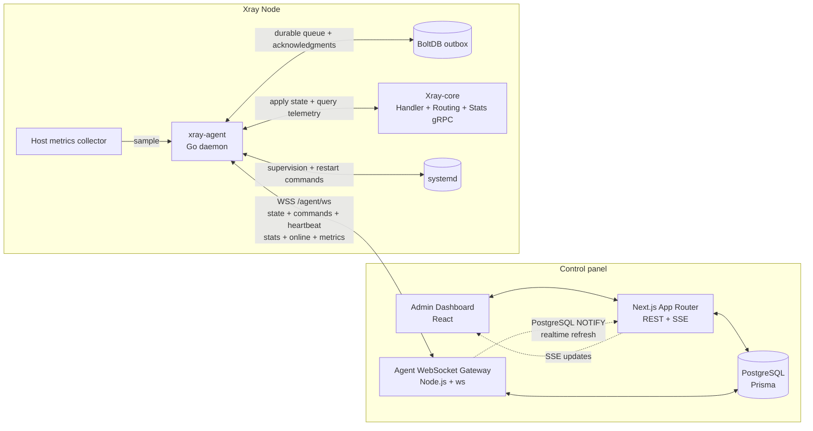

# xray-agent

Provisioning/telemetry side for Xray nodes. The agent stays on the same host as Xray, maintains one outbound WebSocket to the control panel, reconciles users through Xray’s HandlerService gRPC API, manages routing rules via RoutingService, reads usage via StatsService, and sends durable telemetry upstream.

## Highlights

- **Single source of truth** – Control-panel drives `state` JSON; the agent diffs and applies only the deltas.
- **HandlerService apply** – Users are added/removed live via gRPC; no config.json juggling or daemon reloads.
- **RoutingService apply** – Routing rules (field rules) are pushed live via gRPC using outbound tags you define (`direct`, `blocked`, or balancers).
- **Stats over gRPC** – User uplink/downlink counters come from the native StatsService (fast + no subprocesses).
- **Protocol aware** – VLESS / VMess / Trojan clients mapped to dedicated inbound tags for per-protocol isolation.
- **Lightweight** – Pure Go binary; depends only on Xray’s gRPC endpoints exposed on `localhost`.

## Architecture


```mermaid
flowchart LR
  subgraph ControlPlane["Control panel"]
    UI["Admin Dashboard<br/>React"]
    Web["Next.js App Router<br/>REST + SSE"]
    Gateway["Agent WebSocket Gateway<br/>Node.js + ws"]
    DB[(PostgreSQL<br/>Prisma)]

    UI <--> Web
    Web <--> DB
    Gateway <--> DB
    Gateway -. "PostgreSQL NOTIFY<br/>realtime refresh" .-> Web
    Web -. "SSE updates" .-> UI
  end

  subgraph ServerNode["Xray Node"]
    Agent["xray-agent<br/>Go daemon"]
    Outbox[(BoltDB outbox)]
    XrayCore["Xray-core<br/>Handler + Routing + Stats gRPC"]
    Metrics["Host metrics collector"]
    Systemd[(systemd)]

    Agent <--> |"durable queue + acknowledgments"| Outbox
    Agent <--> |"apply state + query telemetry"| XrayCore
    Metrics --> |"sample"| Agent
    Agent <--> |"supervision + restart commands"| Systemd
  end

  Agent <--> |"WSS /agent/ws<br/>state + commands + heartbeat<br/>stats + online + metrics"| Gateway
```

### Component responsibilities

- **Control panel (web/)** – Next.js App Router handles both dashboard views and authenticated API endpoints. Prisma persists servers, clients, stats, metrics, and heartbeat tables, while SSE endpoints (e.g., `/servers/{slug}/metrics/stream`) push refreshed health cards to admins.
- **xray-agent (internal/agent/agent.go)** – Lightweight Go service started by systemd on each node. A persistent socket receives desired state and commands, while background loops collect stats, online users, host/Xray metrics, heartbeats, and core update information. Durable messages are replayed from a local BoltDB outbox until the gateway acknowledges their database commit.
- **Xray-core integration** – Agent communicates with HandlerService/StatsService/RoutingService over gRPC (`127.0.0.1:10085` by default). HandlerService mutates in-memory users without touching config files, RoutingService applies runtime rules, and StatsService reports ever-increasing counters.
- **Dashboard experience** – Admin UI hydrates server cards with `loadServerHealthEntry`, combining the latest heartbeat, server metrics, aggregates, and client listings. SSE events stream updates every ~10 seconds to keep charts and status badges current.

All gRPC traffic is expected to stay on localhost; expose Xray’s API listener only to the agent. The control panel never reaches into Xray directly—it only talks to the agent via WebSocket.

## Configuration

See `internal/agentsetup/assets/config.yaml` for the full schema. High-level knobs:

```yaml
control:
  base_url: https://panel.example.com
  socket_url: "" # optional; derives wss://panel.example.com/agent/ws
  token: AGENT_TOKEN
  server_slug: sg-1
  tls_insecure: false
  outbox_path: /var/lib/xray-agent/outbox.db

xray:
  api_server: 127.0.0.1:10085 # HandlerService + StatsService + RoutingService listener
  api_timeout_sec: 5
  inbound_tags:
    vless: vless-ws
    vmess: vmess-ws
    trojan: trojan-ws

intervals:
  online_sec: 10
  stats_sec: 60
  heartbeat_sec: 30
  metrics_sec: 30
  core_check_sec: 43200

logging:
  level: info
```

### Client reconciliation

HandlerService must be enabled in your Xray config:

```json
{
  "api": {
    "tag": "xray-api",
    "services": ["HandlerService", "LoggerService", "StatsService", "RoutingService"]
  },
  "stats": {}
}
```

The agent needs HandlerService for add/remove, StatsService for counters, and RoutingService for runtime rules. Keep the listener on `127.0.0.1` (or a UNIX socket) because the agent currently dials with plaintext credentials.

To capture online users and their source IPs, enable `statsUserOnline` in your Xray policy and keep `intervals.online_sec` below the Xray online-map expiry window.

Base outbounds (sample config) include:

```json
{ "protocol": "freedom", "tag": "direct" },
{ "protocol": "blackhole", "tag": "blocked" }
```

If you add new outbounds/balancers, declare them statically in config; the agent only pushes rules that reference existing outbound/balancer tags.

## CLI / Install

The agent binary exposes subcommands (default path `/etc/xray-agent/config.yaml`):

- `run` — start the agent; auto-installs Xray-core if missing. Flags: `--config`, `--core-version`, `--github-token`.
- `setup` — install config (from embedded sample), binary to `/usr/local/bin/xray-agent`, and systemd unit to `/usr/lib/systemd/system/xray-agent.service`. Socket-related flags: `--control-base-url`, `--control-socket-url`, `--control-token`, `--control-server-slug`, `--control-tls-insecure`, `--control-outbox-path`.
- `update-config` — update control/socket/GitHub fields and restart agent. Supports the same control flags as `setup`, plus `--github-token` and `--restart`.
- `core` — manage Xray-core install. Flags: `--action check|install`, `--version`, `--github-token`, `--config` (to read defaults).
- `version` — show agent version (from embedded `version` file) and commit (from build info).

### Quick install

```bash
go build -o xray-agent ./
sudo ./xray-agent setup \
  --control-base-url https://panel.example.com \
  --control-token AGENT_TOKEN \
  --control-server-slug sg-1 \
  --github-token GITHUB_PAT
```

Then start normally:

```bash
sudo ./xray-agent run --config /etc/xray-agent/config.yaml
```

Systemd unit (installed by setup subcommand): `/usr/lib/systemd/system/xray-agent.service` with `ExecStart=/usr/local/bin/xray-agent run --config /etc/xray-agent/config.yaml`.

### Release and rollout

- Tagging the repo with `v*` now publishes Linux release binaries via GitHub Actions:
  - `xray-agent_linux_amd64`
  - `xray-agent_linux_arm64`
  - `checksums.txt`
- The dashboard can enqueue an `UPDATE_AGENT` command so each node pulls the
  requested release asset directly from GitHub, verifies its checksum, swaps
  the installed binary, and restarts `xray-agent` through systemd.
- Keep the `version` file aligned with the release tag. The release workflow
  refuses to publish if `version` and the pushed tag differ.

## Control-panel contract

The active runtime contract is [WebSocket protocol v1](docs/socket-protocol.md).

## Development

- Go ≥ 1.25.3 (module declares 1.25.3; see `go.mod`).
- Run `go test ./...` before submitting changes.
- Formatter: `gofmt` (already wired via CI scripts).
- Enable local pre-commit checks:
  - `./scripts/setup-git-hooks.sh`
  - Hook runs `gofmt` on staged `*.go`, then `go vet . ./internal/...`, and `go test . ./internal/...`.

## License

GNU General Public License v3.0 or later

See [COPYING](COPYING) to see the full text.
